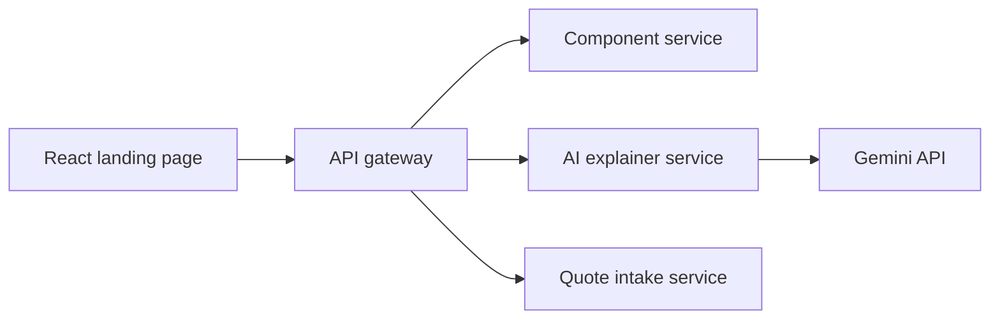

# Architecture

The published assignment is a single landing page. The repository also includes independently deployable services so the AI guide and future order-intake features are not coupled to the presentation layer.

| Service | Port | Responsibility |
| --- | ---: | --- |
| API gateway | 8080 | CORS, routing, upstream timeouts and one public API surface |
| Component service | 8081 | CNC component definitions and critical-feature metadata |
| AI explainer service | 8082 | Gemini interaction, prompt guardrails and curated fallback |
| Quote service | 8083 | Lightweight requirements validation and intake references |

For the hosted demo, `/api/explain` runs at the edge so the interaction works without exposing a key to the browser. Set `NEXT_PUBLIC_API_BASE_URL=http://localhost:8080` to route the React interface through the local microservice stack instead.

## AI resilience

1. Gemini is called only from server-side code.
2. Every call has an eight-second timeout.
3. Non-2xx, malformed, empty and timed-out responses fall back to component-specific CNC knowledge.
4. Inputs are limited to known component IDs and a 280-character question.
5. The UI states that the engineering drawing controls final manufacturing decisions.
